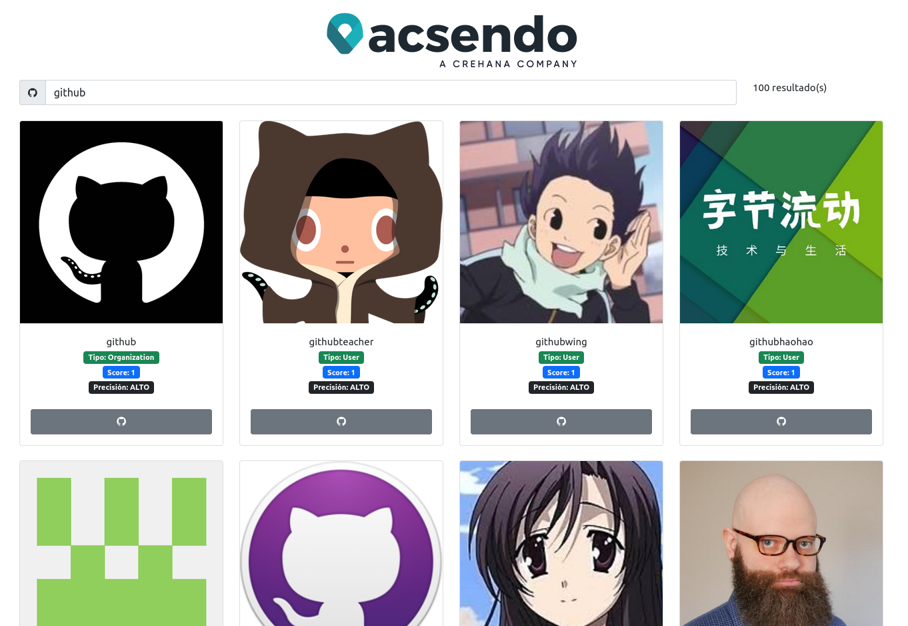
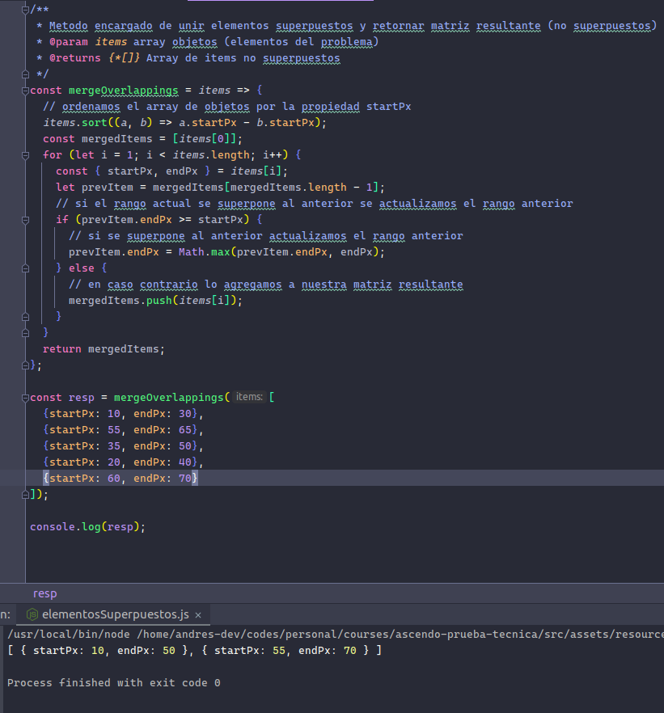

# Prueba técnica Front End position Acsendo

This project was generated with [Angular CLI](https://github.com/angular/angular-cli) version 13.3.3.

## Tecnologías utilizadas
* NodeJS v14
* Bootstrap 5
* Font Awesome
* Angular v13.3.3
* NPM

## Documento propuesto por Acsendo

[prueba_tecnica_front_end_position_acsendo.pdf](./src/assets/resources/prueba_tecnica_front_end_position_acsendo.pdf)

## Puntos Desarrollados

### Punto 1 y 2 (Resumen)

Buscador de usuarios consumiendo la API de github en base a la doc compartida, teniendo presente el limite de peticiones
permitido y manejado el angular pipe para la nueva propiedad relacionada al score del usuario (precisión)

### Punto 3

El punto 3 fue desarrollado siguiendo las indicaciones planteados en el documento compartido,
a continuación la funcion requerida.

[Codigo Fuente](./src/assets/resources/mergeOverlapping.js)

## Instalación de Dependencias
Run `npm install`

## Development server

Run `ng serve` for a dev server. Navigate to `http://localhost:4200/`. The application will automatically reload if you change any of the source files.

## Code scaffolding

Run `ng generate component component-name` to generate a new component. You can also use `ng generate directive|pipe|service|class|guard|interface|enum|module`.

## Build

Run `ng build` to build the project. The build artifacts will be stored in the `dist/` directory.

## Running unit tests

Run `ng test` to execute the unit tests via [Karma](https://karma-runner.github.io).

## Running end-to-end tests

Run `ng e2e` to execute the end-to-end tests via a platform of your choice. To use this command, you need to first add a package that implements end-to-end testing capabilities.

## Further help

To get more help on the Angular CLI use `ng help` or go check out the [Angular CLI Overview and Command Reference](https://angular.io/cli) page.
